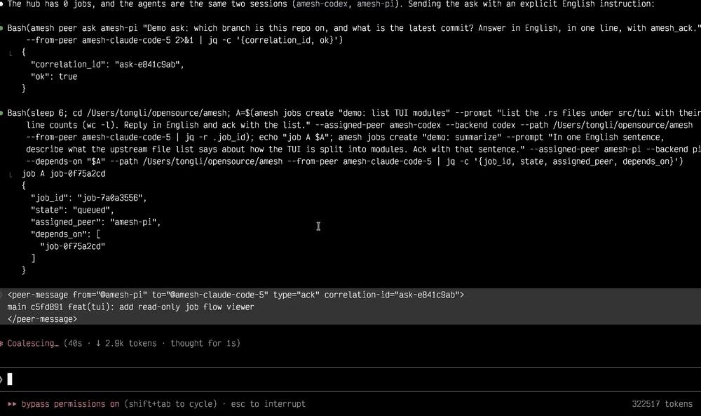
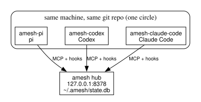
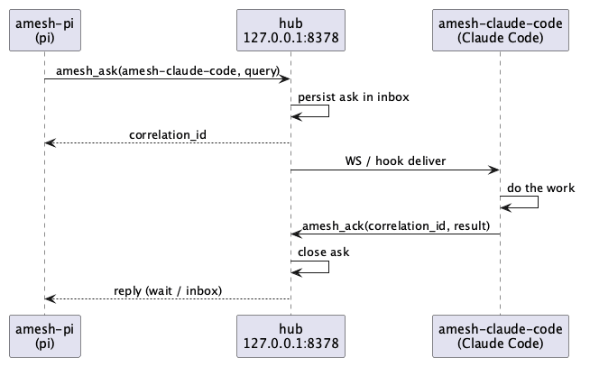

# amesh

Local hub that lets `pi`, Codex, and Claude Code sessions on one machine `ask` / `ack` / `notify` one another.

One Rust binary, SQLite state, HTTP + WebSocket on `127.0.0.1:8378`. Each running session is a **peer**; peers in the same git repo share a **circle**.



`amesh tui` in the demo is optional and only watches. Without it the hub runs quietly in the background and relays asks, acks, notifies and jobs between agents on its own.

## How agents work together

After `amesh setup`, each runtime calls the hub's tools through MCP (`amesh mcp`) and receives pushed messages over a WebSocket (`amesh hook ws`; the pi extension opens its own).



- `ask` is tracked:
  - the recipient closes it with `amesh_ack` (CLI: `peer ack`)
  - the asker waits by `correlation_id` with `amesh_wait` (CLI: `peer wait`)
- `notify` is fire-and-forget.
- `broadcast` goes to the caller's circle.



## Install

Rust + `curl` (the CLI talks to the hub with curl).

```bash
git clone https://github.com/tlhc/amesh
cd amesh
cargo install --path . --force
amesh --help
```

## Quick start

```bash
# terminal 1
amesh serve

# terminal 2
amesh setup pi          # bare `amesh setup` writes all three: ~/.pi, ~/.claude, ~/.codex
curl -s http://127.0.0.1:8378/health
amesh doctor
```

Two agents in the same repo (peer names are `{folder}-{backend}`, so this repo's pi session is `amesh-pi`):

```bash
amesh peer list --cwd .
amesh peer ask amesh-pi "status of the tests" --from-peer operator
```

## Setup

| runtime | `amesh setup …` writes |
|---------|------------------------|
| pi | `~/.pi/agent/extensions/amesh.ts` |
| claude-code | hooks in `~/.claude/settings.json`, MCP in `~/.claude.json` |
| codex | hooks in `~/.codex/hooks.json`, MCP in `~/.codex/config.toml` |

Setup follows config symlinks and keeps file modes; `--home DIR` overrides the install root. A taken name gets `-2`, `-3`; pin one with `--peer-id ID` or `AMESH_PEER_ID`. Ids and circle names are 1-128 characters of `[A-Za-z0-9._-]`; the hub rejects anything else.

pi uses the extension, so setup disables imported amesh MCP entries in `~/.pi/agent/mcp.json`, which would call under another runtime's identity. A file it cannot safely rewrite is left unchanged with a warning; uninstall keeps the override. `PI_CODING_AGENT_DIR` overrides `~/.pi/agent` unless `--home` is given.

`amesh mcp`, `amesh hook`, and the pi extension start `amesh serve` when the hub is down and `AMESH_BIND` is loopback or unspecified (`0.0.0.0` / `::`); `status`, `doctor`, and `peer` do not. Log: `serve.log` next to the state file.

`amesh uninstall [runtime] --apply true` removes the hooks and MCP entries.

### Codex (App Server)

Codex receives messages through App Server. After `amesh setup codex`, start one server and attach sessions with `--remote unix://`:

```bash
codex app-server --listen unix://          # keep running; socket: ~/.codex/app-server-control/app-server-control.sock
codex --remote unix:// -C "$PWD"           # new session in this repo
codex --remote unix:// -C "$PWD" resume --last
```

Pass `-C "$PWD"` to both, since App Server starts in `/`. `amesh hook ws` uses the socket above. Codex binds its peer once it learns the thread from App Server, `CODEX_THREAD_ID`, or the first tool call; resume and hooks reuse that peer. Older clients without thread IDs use separate rows, and pushed delivery needs a known thread.

`amesh setup codex --peer-id ID` pins the name for both MCP and hooks; setting only MCP's `AMESH_PEER_ID` gives the hooks a different peer.

## Circles and tools

A **circle** is one git repo: `project-` plus a short hash of the git common dir, or of the directory without git. MCP tools default to the caller's circle; another circle needs `cross_circle=true`. `broadcast` also needs that `circle`, and list tools with the flag but no `circle` return every circle.

| MCP | purpose |
|-----|---------|
| `amesh_whoami` | this peer |
| `amesh_list_peers` | roster |
| `amesh_ask` / `amesh_ack` / `amesh_wait` | tracked question |
| `amesh_notify_peer` / `amesh_broadcast` / `amesh_ask_many` | notify / broadcast / fan-out |
| `amesh_events` | recent events (this circle) |
| `amesh_job_*` / `amesh_schedule_*` | jobs with dependencies / timed notify or ask |

The CLI mirrors this under `amesh peer`, `amesh jobs`, and `amesh schedule`; `amesh --help` lists the flags.

`amesh_wait` returns status and reply, including `failed`; it waits 45 seconds by default (Codex: 8), at most 50. Acks normally arrive as peer-messages; wait again only if one is missing. `amesh_events` returns 20 entries by default, up to 50, with text trimmed to 200 characters.

MCP list tools and `amesh_events` are circle-scoped; CLI `peer list` shows all peers unless `--cwd` or `--circle` is given. HTTP `GET /peers`, `/jobs`, `/schedules`, and `/events` return every circle and untrimmed records; `GET /events?circle=NAME` filters.

## Jobs

The hub dispatches a job to `assigned_peer` as a tracked ask once all its `depends_on` jobs are `done`, quoting each upstream result up to `job_upstream_chars`. The worker's `amesh_ack` completes it; `failed=true` marks it failed and prefixes the creator's reply with `[failed]`.

Failed or cancelled dependencies leave downstream jobs `queued`. Retry with `amesh_job_update` and `state=queued`; the same update can change `assigned_peer` or `prompt`.

```bash
amesh jobs create audit --prompt "list stale docs" --assigned-peer amesh-codex --from-peer amesh-claude-code
amesh jobs create fix --prompt "fix them" --assigned-peer amesh-pi --depends-on job-1a2b3c4d --from-peer amesh-claude-code
amesh peer ack ask-5e6f7a8b --message "no fixture" --failed true --from-peer amesh-pi
```

- The hub checks jobs every second and reminds creators every `job_nudge_secs` about unanswered, unreachable, or blocked jobs.
- Moving a running job to another state closes its ask. Deleting a job with queued or running dependents returns 409.
- Legacy jobs dispatch only after an explicit `assigned_peer` update.
- Set `from_peer` to receive replies and reminders; anonymous jobs keep results only in `amesh jobs show`, until cleanup.
- A chain of jobs joined by `depends_on` is deleted `job_keep_secs` after all its jobs end, and a closed ask `ask_keep_secs` after closing once no job refers to it; `amesh_wait` and repeated acks then return 404, so take results from the ack. `amesh gc --apply true` cleans up now.
- Reconnect MCP to load new tool parameters; until then use `amesh peer ack <cid> --failed true --from-peer <id>`.
- Pin workers with `amesh setup <runtime> --peer-id`: after a restart under a new name, work waits on the old identity until reassigned.

### Watching jobs

`amesh tui` draws this directory's circle as dependency flows, refreshed every second. It only reads `GET /snapshot`.

```bash
amesh tui                    # this directory's circle
amesh tui --all --ascii      # every circle, ASCII only
```

- Each chain gets its own screen, with numbered jobs under a `chain <name> · done/total` header; jobs without dependencies share one block. The selected job's card shows its result or failure reason, worker, ask and dependencies, plus the command to retry it, nudge its worker, or hand it to another peer.
- Keys:
  - `j`/`k`: move along the chain; `h`/`l`: move within a stage
  - digits: jump by number; `f`: show letter hints
  - `/`: search all chains; `n`/`N`: step through matches
  - `Tab`/`Shift-Tab`: next/previous chain
  - `Enter`: open the full card (scroll with `j`/`k`, the arrows, `space`/`b`, `PgDn`/`PgUp`, `g`/`G`; `Esc` goes back)
  - `r`: refresh; `q`: quit
- Activity:
  - spinner: the worker is busy with this job (`--no-anim` freezes it)
  - `IDLE!`: the worker stopped with the ask open; the card gives a nudge command
  - blinking `WAIT!`: Claude Code waits on a permission
  - hooks installed before this reporting send none; rerun `amesh setup`
- Colours:
  - `tui-theme.json` next to the state file (default `~/.amesh`) overrides the roles `text title dim line done run fail wait worker near select select_bg`
  - without `COLORTERM=truecolor`, colours map to the nearest of 256
  - `NO_COLOR` or `--no-color` drops colour; every state keeps its own glyph

## Environment

| variable | default |
|----------|---------|
| `AMESH_BIND` | `127.0.0.1:8378`; must be `ip:port`, not `localhost` |
| `AMESH_TOKEN` | empty = no auth |
| `AMESH_STATE` | `~/.amesh/state.db` |
| `AMESH_PEER_ID` | peer name override, read by `mcp` / `hook`; `setup` writes it only with `--peer-id` |

`serve` reads `config.toml` next to the state file (default `~/.amesh/config.toml`) once at start; the first start writes it with every key commented out. A commented or missing key keeps the default. A value below its minimum and an unknown key are logged and ignored; a file that cannot be read or is not valid TOML is logged and ignored as a whole. Restart the hub after changing it.

| key | default | minimum | meaning |
|-----|---------|---------|---------|
| `job_keep_secs` | 3600 | 60 | a chain of jobs is deleted this long after all its jobs end |
| `ask_keep_secs` | 3600 | 60 | a closed ask no job refers to is deleted this long after closing |
| `sweep_secs` | 60 | 1 | how often the hub looks for what to delete |
| `job_nudge_secs` | 3600 | 60 | how often a stalled job reminds its creator |
| `job_upstream_chars` | 2000 | 0 | characters of each upstream result quoted into a dependent job's ask |

## Security

The default bind is loopback. Without `AMESH_TOKEN`, any local process can read and write the mesh, including events, transcripts, and attachments, and can run cleanup through `POST /gc`. `/health` is always open.

Set `AMESH_TOKEN` before exposing the port and restart the hub after changing it. A non-loopback bind without a token starts with a warning.

## Limits

- `GET /peers` (and so `amesh status` / `peer list`) probes sockets, drops closed ones, then removes peers with no live WebSocket and `last_seen` older than 30s, and may persist. A removed peer with a session keeps its name for that session while messages or open asks wait for it, up to 24h; then those asks close with a reason. `gc` dry-run can hit this path too; `--home` skips the probe.
- A pinned name is for one session at a time. A different session claiming it closes pending asks, notifies their askers, and discards undelivered messages.
- The event ring keeps the last 500 entries and clears on restart; it is not an audit log.
- On start, peers whose id, name or circle carry characters outside `[A-Za-z0-9._-]` are dropped from the state file and their open asks are closed with a reason; over-long but clean legacy ids are kept.
- `amesh hook ws` keeps undelivered inbound messages in memory; restarting that process drops the queue.
- An older amesh run on the same state file rewrites it without the job fields added for dependencies (`depends_on`, `from_peer`, `ask_id`, `dispatch`, `nudge_at`), the ask `failed` flag, the times the TUI shows (`created_at`, `opened_at`) or how an ask closed (`closed_by`). Copy `state.db` before downgrading, and to keep in-flight jobs, stop the hub and restore that copy when upgrading back.
- `gc` and `uninstall` are dry-run until `--apply true`. Attachments are left alone unless `--attachments-days N`.

## Troubleshooting

```bash
amesh doctor
amesh status
tail -f ~/.amesh/serve.log   # or $AMESH_STATE's directory
```

Port in use: `amesh status`. Wrong `AMESH_TOKEN` returns HTTP 401.

## Related

Hub contract: [docs/protocol-design.md](docs/protocol-design.md).

## License

MIT
